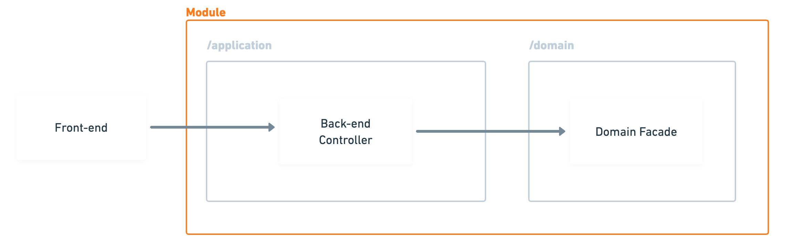

# HappeningTN


[](https://choosealicense.com/licenses/mit/)
[](https://opensource.org/licenses/)
[](http://www.gnu.org/licenses/agpl-3.0)

## About HappeningTN
HappeningTN is a local event listing platform designed to connect people in Tunisia with the latest events, workshops, and cultural activities in their vicinity. Our mission is to foster community engagement and cultural exchange by making it easier for everyone to discover and participate in local events.

## Key Features
- **Event Discovery**: Browse a wide range of events based on categories and interests.
- **User Registration**: Sign up to attend events and receive notifications.
- **Event Management**: Event organizers can create and manage their event listings.
- **Interactive Map**: View events plotted on a map for easy location-based browsing.


## Getting Started
To get started with HappeningTN, clone the repository and follow these steps:
1. Navigate to the `backend` directory and install dependencies:
```bash
cd backend npm install
```

2. Start the backend server:

```bash
npm start
```

3. Navigate to the `frontend` directory and install dependencies:
```bash
cd …/frontend npm install
```

4. Start the frontend development server:
```bash
npm start
```
### Technology Stack

### Monorepo tech-stack

a monorepo using pnpm with the front-end and the back-end of the app inside

## Frontend

apps/web

**Typescript:** Language

**NextJS:** React SSR framework

**Ant Design:** Beautiful design system

## Backend

apps/server

**Node.js:** Environment

**Typescript:** Language

**NestJS:** Node.js framework

**TypeORM:** Database ORM

**PostgreSQL:** Relational database


### architecture

The front-end is built using a beautiful design system called Ant Design. This includes a full library of pre-built components that can easily drop into the application, containing everything from card and tables to self-validating forms, modals and notification.

The front-end is built in TypeScript.
##File structure
```bash
/src
  /app          → the pages of your app
  /designSystem → the theme/style of your app
  /layouts      → the topbar/leftbar present in all your pages
  /domain       → the data models and calls to the API
  /store        → the global state of your app
```

## Environment Variables

| KEY | DEFAULT | DESCRIPTION |
| :---| :------ | :---------- |
| WEB_PORT | 8099 | Application port |
| NEXT_PUBLIC_API_BASE_URL | http://localhost:3099 | Server url |

## App

```bash
/app
  /(authenticated)
    /home
      page.tsx
    /tweets
      /[id]
        page.tsx
    /profile
      page.tsx
  /(non-authenticated)
    /login
      page.tsx
    /register
      page.tsx
```

## Design System

HappingTN uses Ant Design as a design system library.

## Domain

That's where the data models and the API interactions with the back-end live.
```bash
/domain
  /authentication
  /user
  /tweet
    tweet.api.ts
    tweet.model.ts
```
tweet.api.ts
```Typescript
export namespace TweetApi {

  export function findMany(
    queryOptions?: ApiHelper.QueryOptions<Tweet>
  ): Promise<Tweet[]> {

    const buildOptions = ApiHelper.buildQueryOptions(queryOptions)

    return HttpService.get(`/v1/tweets${buildOptions}`)

  }
  ...
```
So if I wanted to fetch all the tweets in my app I would simply do:
```Typescript
import { Api, Model } from '@web/domain'

const tweets = await Api.Tweet.findMany()
```

## File structure
```bash
/src
  /core       → database migration, CORS, cookie
  /helpers    → generic utilities
  /libraries  → external libraries like stripe, google auth, etc..
  /modules    → endpoints/business logic divided by module
```

## Environment Variables
| KEY | DEFAULT | DESCRIPTION |
| :-- | :------ | :---------- |
| NODE_ENV | development | Environment |
| SERVER_PORT | 3099 | Server port |
| SERVER_DATABASE_URL |                 | Database url |
| SERVER_AUTHENTICATION_SECRET |        | Server secret |
| SERVER_CLIENT_BASE_URL |     | Client url | 

## Modules 



i
You will spend most of your time in the modules folder. That's where you have all your endpoints, the queries to the database and the business logic.

A module usually represents a database entity. But sometimes, you might make a module for a service that's not tied to any entity, like handling Stripe webhooks.


## Database

 


The API communicates with a PostgreSQL database using TypeORM.

i highly recommend consulting the NestJS TypeORM documentation for a comprehensive understanding of its functionality.

## Configuration

All database-related code resides in the `src/core/database` folder.

## Migrations

In the development environment, the database schema is automatically synchronized, requiring no manual intervention. However, for other environments, SQL migrations need to be generated and executed.

Update your `.env` file with your production url.
```bash
SERVER_DATABASE_URL=your-production-url
```

Generate migration files
```bash
pnpm run --filter server database:migration:build
```

Run migrations files on the target database

```bash
pnpm run --filter server database:migration:run
```
## Authentication

### Email/password auth

The registration and sign-in authentication process are managed in the api/src/modules/authentication.

- This sign-in checks that:

- the correct password has been provided

If these conditions are met, an auth token is generated and returned to the client along with a user object.

## Email vertification

Email account verification is disabled by default.

### Activate Email Verification

To activate the email verification and automatically verify all new users, you can set the user status to CREATED instead of VERIFIED in `api/src/modules/user/domain/user.model.ts`
```Typescript
  @Column({ enum: UserStatus, default: UserStatus.CREATED })
  status: UserStatus
```
After signing up, a user will be asked to verify their email using a time-sensitive code sent to their registered email address.

Until verified, the JWT token issued to a user will contain an unverified flag, and access to protected API endpoints will be disabled.

## Google auth
To get your Google client id, follow the quick tutorial here. The callback URL is
`https://yourapp.com/authentication/google`

Once you have it, add it to your API .env:
```bash
GOOGLE_CLIENT_ID=your-client-id
```
And it to your Front-end .env:
```bash
NEXT_PUBLIC_GOOGLE_CLIENT_ID=your-client-id
```
The Google sign-in button will automatically appear in the login when the .env variable is detected.

## Create an API endpoint

HappingTN already generates all the basic API endpoints you would need for each entity in database


## Contributing
We welcome contributions to HappeningTN! If you have suggestions or want to contribute code, please feel free to make a pull request or open an issue.

## License
HappeningTN is open source and available under the MIT License.

## Contact
For any queries or feedback, please reach out to [sassihamdi777@gmail.com].

## Acknowledgments
A special thanks to everyone who has contributed to making HappeningTN a reality.
 
